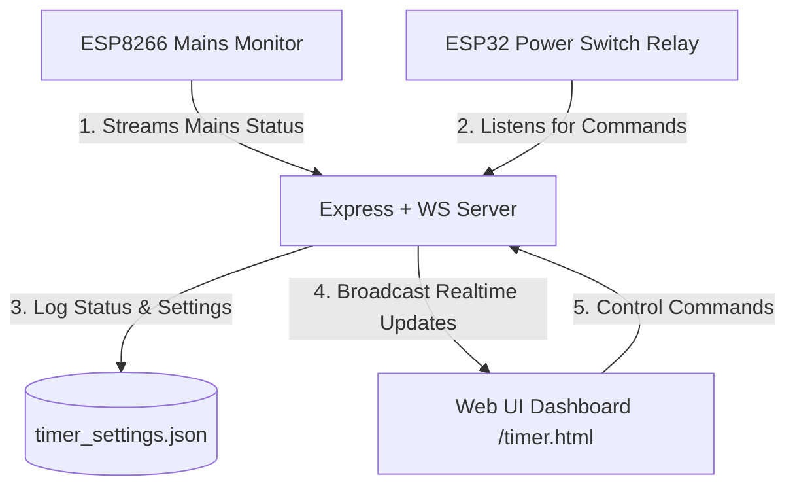

# HomePulse - Live ESP8266 Grid Power Sentinel & Power Timer Switch

This project delivers a real-time smart grid monitor and priority power switch dashboard using Express, WebSockets, Web Audio APIs, and SQLite/JSON state persistence.

If a power outage occurs (reported by ESP8266), the dashboard triggers a flashing warning banner, plays a browser-synthesized wailing siren, and automatically disables any active grid-dependent relays via the **Control Main Source** priority safety mechanism.

---

## 🏗️ Architecture Overview



---

## 📂 Project Structure

All files are located in `/home/neeraj/Public/node/HomePulse/`:

- **`app.js`**: Main entry point initializing HTTP and WS servers, managing secure upgrades, and broadcasting status to UI clients and public APIs.
- **`controllers/sensorController.js`**: Manages real-time mains state storage and updates.
- **`controllers/timerController.js`**: Controls the Power Timer Switch, Alarm Schedules, and Control Main Source priority logic.
- **`routes/api.js`**: Exposes HTTP endpoints (`/api/status`, `/api/alarm/silence`, and the public `/api/live`).
- **`public/index.html`**: Front-end layout featuring glassmorphism cards and the responsive dashboard.
- **`public/timer.html`**: Secure password-protected dashboard for controlling Timer, Alarm, Manual Toggle, and Control Main Source logic.
- **`public/test.html`**: Standalone mock client panel simulating ESP8266 & ESP32 WebSocket broadcasts.
- **`public/style.css`**: Premium dark neon styles, breathing gradients, bulb flicker animations, and high-visibility red flashing alert banners.
- **`public/script.js`**: Handles WebSocket connections, UI updates, detuned dual-oscillator sirens, and silent background audio unlock.

---

## ⚡ Setup & Launching the Server

1. **Verify Dependencies**: Make sure you have installed the required Node packages (configured in `package.json`):
   ```bash
   npm install
   ```

2. **Configure Environment**: Create a `.env` file in the root directory:
   ```env
   PORT=5000
   TIMER_PASSWORD=1234
   ESP32_TOKEN=HomePulseESP32SecretToken2026
   ```

3. **Start the Server**: Run the application in your terminal:
   ```bash
   node app.js
   ```

4. **Access the Dashboard**: Open your browser and navigate to:
   * **Main Dashboard**: `http://localhost:5000`
   * **Power Timer Switch (Password Lock)**: `http://localhost:5000/timer.html`

---

## ⏱️ Power Timer Switch & Priority Control Logic

The Power Timer Switch page introduces premium power automation and grid status synchronization:

### 1. Control Main Source (Safety Override)
When **Control Main Source** is turned **ON**:
* **Grid Outage Safety**: If main grid power is lost (`light: false`), the physical relay is immediately forced **OFF** to prevent damage/unwanted drain.
* **Smart Memory Recovery**: If a user sets the power switch to **ON** (manually, via timer, or via alarm) while the grid is offline, the system remembers this preference. When grid power returns (`light: true`), the relay automatically flips **ON**.
* **Auto-Mirroring**: If the main source goes offline, it will only trigger a turn-OFF. Toggling grid status to active will not trigger a turn-ON unless the relay's logical state was already set to `ON`.

### 2. Countdown Timer
Allows setting a one-shot countdown (Hours, Minutes, Seconds) to trigger either a Turn-ON or Turn-OFF action.

### 3. Alarm Schedule
Enables scheduling a specific daily trigger time (HH:MM). Once the alarm triggers, the schedule **automatically disables** ("Enable Scheduled Trigger" toggles off) to prevent accidental repeating triggers.

### 4. High-End UI Features
* **Auto-Hiding Toast Alerts**: Visual slide-in feedback notifications in the top-right corner for page unlocks, connection shifts, timer launches, and alarm saves.
* **Smart Input Disabling**: Schedule inputs (time, action) are locked out once a trigger is active to prevent configuration drift.

---

## 🧪 Testing with the Built-in Hardware Simulator

The `test.html` page simulates both an ESP8266 mains grid reporter and an ESP32 power switch relay:

1. Open `http://localhost:5000/test.html` in a separate tab.
2. Under **ESP8266 Monitor**, click **Connect** and toggle the Grid Switch.
3. Under **ESP32 Relay**, click **Connect** with your security token to view physical relay actions triggered by dashboard timers, alarms, or control source settings.

---

## 🔌 Connecting Physical ESP32 Hardware (Relay Switch)

Flash the following code snippet to your ESP32 device to control a physical relay module over WebSockets:

```cpp
#include <WiFi.h>
#include <ArduinoJson.h>
#include <WebSocketsClient.h>

WebSocketsClient webSocket;
const int RELAY_PIN = 5; // GPIO5 connected to your Relay Input

void webSocketEvent(WStype_t type, uint8_t * payload, size_t length) {
    switch(type) {
        case WStype_DISCONNECTED:
            Serial.println("[WS] Disconnected!");
            digitalWrite(RELAY_PIN, LOW); // Safe default
            break;
        case WStype_CONNECTED:
            Serial.println("[WS] Connected!");
            break;
        case WStype_TEXT: {
            Serial.printf("[WS] Received: %s\n", payload);
            StaticJsonDocument<200> doc;
            DeserializationError error = deserializeJson(doc, payload);
            if (!error && doc.containsKey("relay")) {
                const char* state = doc["relay"];
                if (strcmp(state, "on") == 0) {
                    digitalWrite(RELAY_PIN, HIGH);
                    Serial.println("Relay turned ON");
                } else {
                    digitalWrite(RELAY_PIN, LOW);
                    Serial.println("Relay turned OFF");
                }
            }
            break;
        }
    }
}

void setup() {
    Serial.begin(115200);
    pinMode(RELAY_PIN, OUTPUT);
    digitalWrite(RELAY_PIN, LOW);

    WiFi.begin("YOUR_WIFI_SSID", "YOUR_WIFI_PASSWORD");
    while (WiFi.status() != WL_CONNECTED) {
        delay(500);
        Serial.print(".");
    }
    Serial.println("\nWiFi Connected!");

    // Connect to server (Replace with your actual server IP)
    webSocket.begin("YOUR_SERVER_IP", 5000, "/ws/esp32?token=HomePulseESP32SecretToken2026");
    webSocket.onEvent(webSocketEvent);
    webSocket.setReconnectInterval(5000);
}

void loop() {
    webSocket.loop();
}
```
