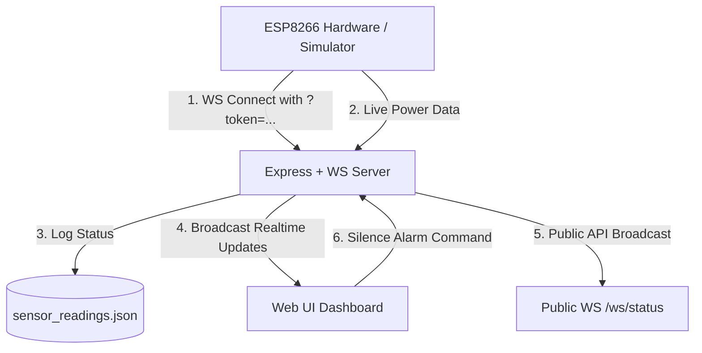

# HomePulse - Live ESP8266 Grid Power Sentinel

This project delivers a real-time smart grid monitor dashboard using Express, WebSockets, and Web Audio APIs. If a power outage occurs (reported by ESP8266), the dashboard triggers a flashing red warning state, shows a prominent large-letter status alert in Hindi (for family accessibility), and synthesizes a realistic wailing emergency alarm siren in the browser until it is manually silenced on the UI or power is restored.

---

## 🏗️ Architecture Overview



---

## 📂 Project Structure

All files are located in `/home/neeraj/Public/node/HomePulse/`:

- **`app.js`**: Main entry point initializing HTTP and WS servers, managing secure upgrades, and broadcasting status to UI clients and public APIs.
- **`controllers/sensorController.js`**: Manages real-time state storage and updates.
- **`routes/api.js`**: Exposes HTTP endpoints (`/api/status`, `/api/alarm/silence`, and the public `/api/live`).
- **`public/index.html`**: Front-end layout featuring glassmorphism cards and the responsive dashboard.
- **`public/test.html`**: Standalone mock client panel simulating ESP8266 WebSocket broadcasts.
- **`public/style.css`**: Premium dark neon styles, breathing gradients, bulb flicker animations, and high-visibility red flashing alert banners.
- **`public/script.js`**: Handles WebSocket connections, UI updates, detuned dual-oscillator sirens, and silent background audio unlock.
- **`.gitignore`**: Excludes dependencies, secret files, local logs, and generated database state files from Git tracking.

---

## ⚡ Setup & Launching the Server

1. **Verify Dependencies**: Make sure you have installed the required Node packages (configured in `package.json`):
   ```bash
   npm install
   ```

2. **Start the Server**: Run the application in your terminal:
   ```bash
   node app.js
   ```
   *The server will start on port `5000` (or the port specified in `.env`).*

3. **Access the Dashboard**: Open your browser and navigate to:
   ```text
   http://localhost:5000
   ```

---

## 🧪 Testing with the Built-in Hardware Simulator

We built a standalone **Virtual ESP8266 Simulator** that you can open alongside the main dashboard to test the WebSocket system:

1. Open the **Main Dashboard** at:
   ```text
   http://localhost:5000
   ```
2. Open the **Virtual Simulator** in a separate tab/window at:
   ```text
   http://localhost:5000/test.html
   ```
3. Click **Connect Virtual ESP** on the simulator page. The status badge will change to a glowing green **CONNECTED**.
4. Click **Power CUT (Low)** on the simulator:
   - The Main Dashboard will update instantly.
   - The top banner flashes in large Hindi letters: **"बिजली चली गई है!"** (Power has gone!).
   - The bulb displays an offline grey state.
   - A realistic wailing dual-sawtooth emergency siren will begin playing in the browser (unlocks on your first click anywhere on the page).
5. Click **Power ON (High)** on the simulator:
   - The dashboard updates back to **"बिजली चालू है"** (Power is ON).
   - The warning bulb triggers a realistic physical **neon startup flicker** before settling into a warm breathing glow.
   - The wailing siren shuts off automatically with a smooth fade-out.

---

## 🔗 Public Integration APIs

HomePulse supports public integration routes so other users or third-party home automation systems can read the live power status:

### 1. Live WebSocket API
* **Endpoint**: `ws://localhost:5000/ws/status`
* **Response Format**:
  * Broadcasts the status in real time to all connected clients upon any power grid state change.
  * **JSON Output**:
    * `{ "power": "on" }` — Grid power is active.
    * `{ "power": "off" }` — Power outage occurred.
    * `{ "power": "unknown" }` — ESP8266 monitor is disconnected/offline.

### 2. Live HTTP GET API
* **Endpoint**: `http://localhost:5000/api/live`
* **Response Format**:
  * Returns the current grid power state in JSON:
  * `{ "power": "on" | "off" | "unknown" }`

---

## 🔌 Connecting Physical ESP8266 Hardware

To connect your real ESP8266, compile and flash the following code snippet. It connects to your local Wi-Fi network and streams GPIO values over an authenticated WebSocket connection:

```cpp
#include <ESP8266WiFi.h>
#include <WebSocketsClient.h>

WebSocketsClient webSocket;
const int SENSOR_PIN = 4; // GPIO4 (D2) connected to your power sensor

void setup() {
    Serial.begin(115200);
    WiFi.begin("YOUR_WIFI_SSID", "YOUR_WIFI_PASSWORD");

    // Connect to server (Change IP to your computer's local network IP)
    webSocket.begin("YOUR_SERVER_IP", 5000, "/ws/esp?token=HomePulseESP8266SecretToken2026");
    webSocket.onEvent(webSocketEvent);
}

void loop() {
    webSocket.loop();

    static unsigned long lastCheck = 0;
    if (millis() - lastCheck > 2000) {
        lastCheck = millis();
        bool isPowerOn = digitalRead(SENSOR_PIN) == HIGH;

        // Send status to server
        String payload = "{\"light\": " + String(isPowerOn ? "true" : "false") + "}";
        webSocket.sendTXT(payload);
    }
}
```

> [!IMPORTANT]
> Change `YOUR_SERVER_IP` to your computer's local network IP (e.g. `192.168.1.XX`) and ensure both devices are connected to the same local Wi-Fi router.
