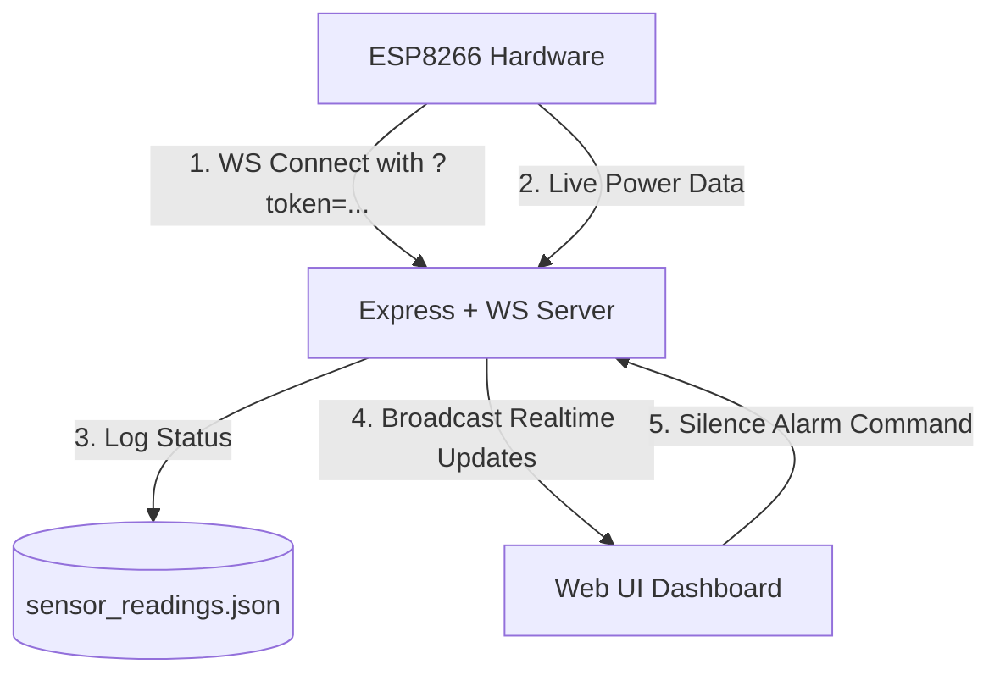

# HomePulse - Live ESP8266 Grid Power Sentinel

This project delivers a real-time smart grid monitor dashboard using Express, WebSockets, and Web Audio APIs. If a power outage occurs (reported by ESP8266), the dashboard triggers a glowing red warning state and synthesizes an alarm tone in the browser until it is manually silenced on the UI or power is restored.

---

## 🏗️ Architecture Overview



---

## 📂 Project Structure

All files have been set up in `/home/neeraj/Public/node/HomePulse/`:

- **`app.js`**: Main entry point initializing HTTP and WS servers, managing secure upgrades, and broadcasting updates.
- **`controllers/sensorController.js`**: Reads/writes real-time states and keeps history logs in `sensor_readings.json`.
- **`routes/api.js`**: Exposes HTTP endpoints (`/api/status`, `/api/alarm/silence`).
- **`public/index.html`**: Front-end layout featuring glassmorphism cards and an interactive hardware simulator.
- **`public/style.css`**: Dark-themed neon styles, floating background orbs, and pulsating status rings.
- **`public/script.js`**: Handles WebSockets, UI updates, Web Audio synthesizers, and developer mock testing.
- **`assets/json/sensor_readings.json`**: Persistent JSON store for system states and activity logs.
- **`.env`**: Port configuration and ESP8266 secret security token.

---

## ⚡ Setup & Launching the Server

1. **Verify Dependencies**: Make sure you have installed the required Node packages (already configured in `package.json`):

   ```bash
   npm install
   ```

2. **Start the Server**: Run the application in your terminal:

   ```bash
   node app.js
   ```

   _The server will start on port `5000` (or the port specified in `.env`)._

3. **Access the Dashboard**: Open your browser and navigate to:
   ```text
   http://localhost:5000
   ```

---

## 🧪 Testing with the Built-in Hardware Simulator

You do not need ESP8266 hardware plugged in to test this! We built a **Virtual Hardware Simulator** directly into the developer panel of the dashboard:

1. Click **Enable Audio** on the top blue banner (required by browsers to allow sounds).
2. Scroll to the **Virtual ESP8266 Hardware Simulator** card at the bottom.
3. Click **Connect Virtual ESP**. The simulator will establish a secondary secure WebSocket connection (`/ws/esp?token=...`) to the server.
4. Click **Simulate Power Cut (OFF)**:
   - The ESP status indicator changes to **ONLINE**.
   - The Mains Electricity status changes to **OFF** with a pulsing red neon glow.
   - The browser will begin playing a synthesized warning alert sweep sound.
   - The wave visualizer will start dancing.
5. Click **Silence Audio Siren**:
   - The sound will stop playing.
   - The visualizer will transition to a muted golden color.
6. Click **Simulate Power Back (ON)**:
   - The status changes back to **ON** (glowing yellow).
   - The alert automatically disarms and logs the event.

---

## 🔌 Connecting physical ESP8266 Hardware

To connect your real ESP8266, compile and flash the following code snippet. It connects to your local Wi-Fi network and streams GPIO values over a authenticated WebSocket connection:

```cpp
#include <ESP8266WiFi.h>
#include <WebSocketsClient.h>

WebSocketsClient webSocket;
const int SENSOR_PIN = 4; // GPIO4 (D2) connected to your power sensor

void setup() {
    Serial.begin(115200);
    WiFi.begin("YOUR_WIFI_SSID", "YOUR_WIFI_PASSWORD");

    // Connect to server (Change IP to your computer's local network IP)
    webSocket.begin("YOUR_SERVER_IP", 5000, "/ws/esp?token=HomePulseESP8266SecretToken2026");
    webSocket.onEvent(webSocketEvent);
}

void loop() {
    webSocket.loop();

    static unsigned long lastCheck = 0;
    if (millis() - lastCheck > 2000) {
        lastCheck = millis();
        bool isPowerOn = digitalRead(SENSOR_PIN) == HIGH;

        // Send status to server
        String payload = "{\"light\": " + String(isPowerOn ? "true" : "false") + "}";
        webSocket.sendTXT(payload);
    }
}
```

> [!IMPORTANT]
> Change `YOUR_SERVER_IP` to your computer's local network IP (e.g. `192.168.1.XX`) and ensure both devices are connected to the same local Wi-Fi router.
